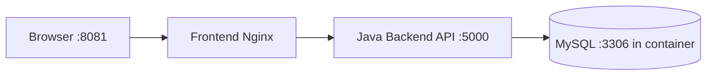

# Assignment 1: Dockerized Full-Stack Application

This project is a sample full-stack application with:
- Frontend: HTML/CSS/JavaScript served by Nginx
- Backend: Java (JDK 17) HTTP API
- Database: MySQL 8

All components run with Docker Compose.

## Project Structure

- `frontend/` - UI files and frontend Dockerfile
- `backend/` - Java backend source, Maven config, backend Dockerfile
- `db/` - Database initialization SQL
- `docker-compose.yml` - Multi-container orchestration

## Architecture



## Ports

Host to container port mapping:
- Frontend: `8081:80`
- Backend: `5000:5000`
- Database: `3307:3306`

Note:
- `3307` is used on host to avoid conflicts with existing local MySQL on `3306`.
- `8081` is used on host to avoid conflicts with existing apps on `8080`.

## Prerequisites

- Docker Desktop installed and running
- Docker Compose available (`docker compose`)

## Run the Application

From this folder (`assignment1`):

```powershell
docker compose up --build -d
```

Check container status:

```powershell
docker compose ps
```

## Access the Application

- Frontend: http://localhost:8081
- Backend health: http://localhost:5000/health
- Backend products API: http://localhost:5000/api/products

## API Endpoints

### 1) Health Check

- Method: `GET`
- URL: `/health`
- Example response:

```json
{
  "status": "ok",
  "service": "backend",
  "database": "connected"
}
```

### 2) Get Products

- Method: `GET`
- URL: `/api/products`

### 3) Add Product

- Method: `POST`
- URL: `/api/products`
- Content-Type: `application/json`
- Body example:

```json
{
  "name": "Webcam",
  "quantity": 12
}
```

## Verify Functionality

Run these commands:

```powershell
Invoke-RestMethod -Uri "http://localhost:5000/health"
Invoke-RestMethod -Uri "http://localhost:5000/api/products"
Invoke-RestMethod -Method Post -Uri "http://localhost:5000/api/products" -ContentType "application/json" -Body '{"name":"Webcam","quantity":12}'
Invoke-RestMethod -Uri "http://localhost:5000/api/products"
(Invoke-WebRequest -UseBasicParsing -Uri "http://localhost:8081").StatusCode
```

Expected:
- Health endpoint returns `status: ok`
- Product list is returned from MySQL
- POST creates a new row in DB
- Frontend returns HTTP `200`

## MySQL Workbench Connection

Use these values in MySQL Workbench:
- Hostname: `127.0.0.1`
- Port: `3307`
- Username: `appuser`
- Password: `apppass`
- Default schema: `appdb`

## Stop the Application

```powershell
docker compose down
```

To also remove DB persisted volume:

```powershell
docker compose down -v
```

## Troubleshooting

1. Port already allocated
- Change host ports in `docker-compose.yml`.

2. Backend not starting
- Check logs:

```powershell
docker compose logs backend --tail 100
```

3. DB connection issues
- Confirm db container is healthy:

```powershell
docker compose ps
```
